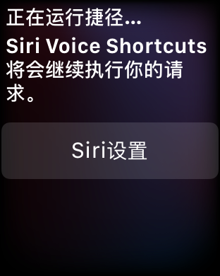

# Siri Shortcut Assistant SQL version

本程序允许你通过 Siri shortcut 程序控制任何安装了客户端并连接互联网的 PC 设备，使其执行 CMD 命令。

## Require

能够执行 siri shortcut 的设备：搭载 iOS 12.0 及以上的 iPhone、iPad，或者搭载 watchOS 5 及其以上的 Apple Watch。

一台具有公网IP地址的服务器，能够进行 ssh 登录，运行 mySQL Server，并且提供对于 mySQL 进行数据读写的网络能力。

任何支持 Java 1.8 及其以上平台的 PC，安装 Siri RMI Client 客户端程序，监听数据库。

## Procedure

程序被封装在一个 jar 包中，siri 可以通过 SSH 连接服务器执行程序，此程序向 mySQL 数据库写入数据。客户端每10s执行 mySQL 数据库查询，如果找到对应本机的尚未执行的命令，就调用本地环境执行，然后将结果写回数据库。

## Technology

服务端的程序和客户端的程序封装在同一个 jar 包中，其中用来写入 SQL 命令的服务器端被称之为 Killer，而执行命令的 PC 被称之为 Caller。本来打算用 RMI 来写的，在本机测试很好，但是上传到服务器测试就连接不通，程序代码在 com.mazhangjing.server/client 中，如果有人能帮我指出问题所在，我将不胜感激。

实现执行 cmd 命令的困难在于 PC 没有公网访问 IP。我尝试通过 DDNS 和 花生棒解决，不稳定，效果不太好，并且没有通用性，遂放弃将 PC 作为服务端的想法。所有 IM 应用都要保持长连接，根据之前 QQ 远程访问 PC 文件的经验，我觉得既然 PC 不能充当服务端，那么肯定需要有一个长连接来查询远程服务器状态，然后执行。说白了就是要提供一个 server 的服务，server 端可以是基于 web 的，也可以是直接像我这样，基于一个 mysql 服务器的。

本程序的问题在于，客户端使用了数据库的用户名和密码来访问数据库，而没有经过 web service 层，因此安全性上受限，但是，如果要提供 web
service 层，那么将需要自己处理各种 HTTP 连接问题，比如保持连接、掉线管理等，还要额外维护一个服务器，并且也存在用户认证的问题，将大幅增加部署成本。因此，简单起见，采用 mySQL 直接作为服务器的配置，在客户端利用了 C3P0 数据库连接池，减缓 10s 查询对于服务器连接造成的压力。

程序需要 Java SE Platform 8 及其以上的版本。在 [此处](https://java.com/zh_CN/download/) 下载 JRE 1.8。

程序使用了 MySQL JDBC 驱动、DBUtils、C3P0 数据库连接池类库。

数据库连接数、连接地址、用户名设置在执行根目录下的  c3p0-config.xml 中进行配置。

指定pc id、killer id、数据库具名策略、程序执行策略，在 server.properties 中进行配置。

服务端需要一台能够 SSH 并且执行 Java 程序的 Linux 内核服务器，并运行 MySQL Server。

## Siri RMI Caller

Server 端需要安装 Java 1.8 及以上的环境，以及运行 mysql。纯图形化界面推荐使用宝塔 bt.cn 面板，安装好后直接提示安装 MySQL，建一个网站，自动弹出设置 MySQL 数据库用户名和密码，使用 ip + 默认数据库端口 作为数据库访问地址即可，注意云服务器安全组和宝塔端口设置。安装 Java ，在 Ubuntu 下直接 `sudo apt-get install openjdk-8(openjre-8)` 即可。

在 Server 端执行 Siri.jar 即可，传入一个参数，此参数为需要执行的 cmd 命令。程序会拼合此处数据，添加 “cmd /c” 前缀执行。

比如： `java -jar Siri.jar "shutdown /s /t 300"`

pc 会执行 `cmd /c shutdown /s /t 300` 这条命令。添加前缀的行为是因为使用了 CMDStratagy，你可以在 server.properties 配置 BasicStratagy 来避免添加前缀。或者使用你自己的继承自 Stratagy 类的子类。

Siri 语音执行需要在 捷径 APP，使用 ssh 登陆到此服务器，cd 到程序目录，执行上述语句即可。捷径会获取到执行结果。

你可以在 c3p0-config 配置 named-config 为 Caller 的组策略，user 对应 mysql 用户名，password 对应密码，jdbcUrl 按照 jdbc 格式写 mysql 的地址、数据库，使用 useSSL = false 参数指定数据库不使用 SSL。服务端因为每次仅仅执行一条语句，因此数据池尽可能设置少的连接数即可，这里主要是为 PC 调用端服务的。在 server.properties 中指定 server_config_name 为 Caller，即可调用此数据池配置策略。

注意，这两个配置文件必须位于 Siri.jar 同目录下。

SQL Server 必须创建名称为 customer 的表，SQL 命令如下：

```sql
CREATE TABLE `command` (
  `com_id` int(11) NOT NULL AUTO_INCREMENT,
  `pc_id` int(11) DEFAULT NULL,
  `server_id` int(11) DEFAULT NULL,
  `command` varchar(100) NOT NULL,
  `result` varchar(100) DEFAULT NULL,
  `status` int(11) DEFAULT '0',
  PRIMARY KEY (`com_id`),
  UNIQUE KEY `command_com_id_uindex` (`com_id`)
) ENGINE=InnoDB AUTO_INCREMENT=60 DEFAULT CHARSET=utf8 COMMENT='mysql message for siri shortcut'
```

## Siri RMI Killer

在需要执行命令的电脑上打开 CMD，切换到 Siri.jar 同名目录，执行 `java -cp Siri.jar com.mazhangjing.shortcut.dbkiller.Killer` 即可运行服务。

同样的，配置文件 c3p0-config 和 server.properties 必须位于 Siri.jar 同名目录下。此外，需要指定 server.properties 中 pc_config_name 对应的 c3p0-config 的具名策略，注意，客户端因为每10s检查一次数据库，因此，需要保证一定量的数据库连接，默认的配置为 Caller，数据库连接为 5。

## Control multiple devices

你可以同时控制多台电脑，方法是：在第二台电脑上复制一份程序，在 server.properties 中设置新的 pc_id, 然后在服务器复制一份程序到新目录下，比如原来的叫做 siri-1 目录，现在复制到 siri-2 目录，然后设置 需要控制的 pc_id 为第二台电脑的 pc_id，执行的时候，只要分别用 `cd siri-1; java -jar Siri.jar "command for a"` `cd siri-2; java -jar Siri.jar "command for b"` 即可分别向两台电脑发送命令。

## Demo

### watchOS 5




### ios 12


## Download

siri shortcut server/client: [Siri.jar](dist.rar)

siri shortcut icloud share: [go.mazhangjing.com/shortcut-demo](http://go.mazhangjing.com/shortcut-demo)
